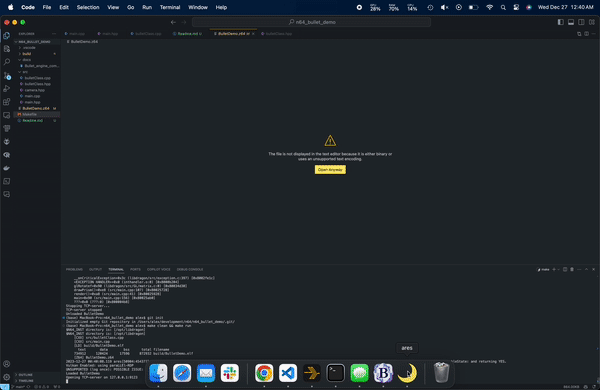

# Bullet Physics with libdragon N64 SDK

This repository provides an example of using Bullet Physics with the N64 libdragon SDK OpenGL branch to create physics simulations on the Nintendo 64 console. It is not working perfectly, but I figured I would share it in case anyone else is interested in using Bullet Physics on the N64. I am not a Bullet Physics or Libdragon or C++ expert, so I am sure there are better ways to do things. I will try to update this repository as I learn more.

Check the docs folder for more information.

## Table of Contents

- [Bullet Physics with libdragon N64 SDK](#bullet-physics-with-libdragon-n64-sdk)
- [Demo Video](#demo-video)
- [Getting Started](#getting-started)
- [Bullet Engine Compilation](docs/Bullet_engine_compilation.md)
- [About the Example](#about-the-example)


## Demo Video



## Getting Started

To get started, follow these steps:

1. Clone the official Bullet Physics repository from [here](https://github.com/bulletphysics/bullet3). The latest commit should work. For reference, the commit used in this example is: 6bb8d1123d8a55d407b19fd3357c724d0f5c9d3c.

2. Configure the custom CMake toolchain to point to your libdragon SDK. The toolchain file `N64Toolchain.cmake` is included in this repository. Place it in the root of the Bullet Physics repository.

3. Run CMake to generate the build files:
```
    cmake -DCMAKE_TOOLCHAIN_FILE=N64Toolchain.cmake -DBUILD_UNIT_TESTS=OFF -DBUILD_BULLET3=OFF -DCMAKE_INSTALL_PREFIX:PATH=/opt/libdragon .
```

## About the Example

The code in the src/ directory provides an example implementation of physics for a 3D game on the N64 using the Bullet Physics library. Here's a description of how one could use this code as an example for implementing physics in their own 3D game for the N64:

- bulletClass.hpp/cpp: These files define a PhysicsObjectClass that encapsulates the Bullet Physics functionality. It includes the necessary Bullet Physics headers and uses a vector to store rigid bodies. You can use this class as a starting point for managing physics objects in your game.

- main.cpp: This file contains the main game loop and rendering logic. It includes the necessary headers for libdragon, OpenGL, and the custom camera.hpp and bulletClass.hpp files. The render() function is responsible for rendering the scene and updating the physics simulation. You can study this function to understand how to integrate Bullet Physics with your rendering code.

- camera.hpp: This file defines a camera_t struct and functions for transforming the camera in the scene. You can use this code as a reference for implementing camera movement and rotation in your game.

- main.hpp: This file includes the necessary headers for the game, such as libdragon.h and GL/gl.h. It also declares functions used in main.cpp. You can add your own function declarations here as needed.

By studying and understanding this code, you can learn how to:

Initialize the Bullet Physics library and create a PhysicsObjectClass to manage rigid bodies.
Integrate the physics simulation with the game loop and rendering logic.
Implement collision detection and response using Bullet Physics.
Use the libdragon library for graphics rendering and input handling.
Implement camera movement and rotation in a 3D scene.
To adapt this code for your own game, you can modify and extend the PhysicsObjectClass to include additional functionality specific to your game's physics requirements. You can also customize the rendering logic and camera behavior to suit your game's needs.

Remember to refer to the libdragon documentation and the Bullet Physics documentation for more details on how to use these libraries effectively in your N64 game development.

Overall, this code provides a solid starting point for implementing physics in a 3D game for the N64 using Bullet Physics and libdragon. I hope you find it useful!
